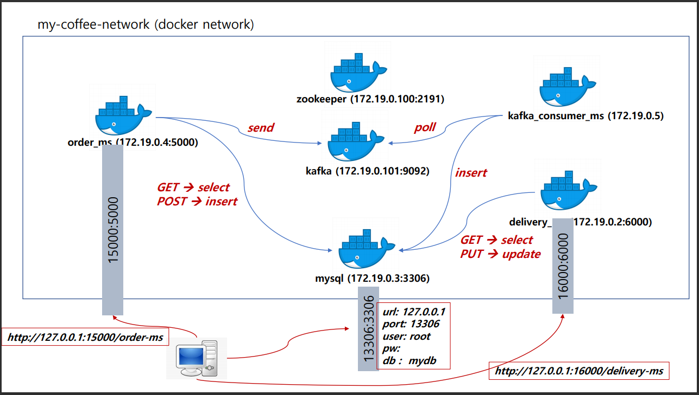

## Flask로 cafe order 서버 구축 & 컨테이너 배포

> flask를 이용한 coffee 주문, kafka를 이용한 데이터 동기화, 업데이트, docker를 통한 배포

 

### order_ms 컨테이너 실행

`docker run -d -p 15000:5000 --network my-coffee-network --name order_ms 1yangsh/order-ms`

### MySQL 실행

`docker run -d -p 13306:3306 --network my-coffee-network -e MYSQL_ALLOW_EMPTY_PASSWORD=true --name mydb mysql:5.7`

### kafka_consumer_ms 실행

`docker run -d --network my-coffee-network --name kafka_consumer 1yangsh/kafka_consumer`

